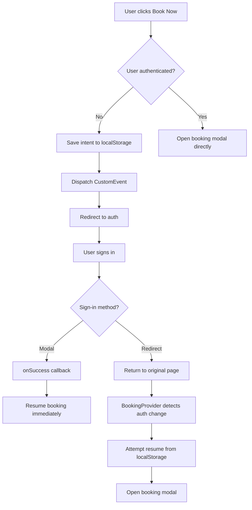

# Booking Intent Resume Mechanism

## Overview

This document explains the robust booking intent resume mechanism implemented to ensure users never lose their booking flow when signing in. The solution implements a 3-tier approach to handle various sign-in scenarios.

## 3-Tier Resume Approach

### 1. Immediate Callback (Modal Sign-in)
When a user signs in via a modal (email/password), the onSuccess callback immediately resumes the booking flow.

### 2. Persisted Intent (Redirect/OAuth)
Before any redirect (OAuth, magic link, etc.), the booking intent is saved to localStorage so it can be resumed after authentication.

### 3. Provider-Ready Resume
The BookingProvider registers a startup listener that resumes pending intents only when it's ready, with retries for race conditions.

## Implementation Details

### Key Components

1. **NewBookNowButton.tsx** - Handles the initial booking click and intent saving
2. **BookingContext.tsx** - Implements the provider-ready resume mechanism
3. **bookingIntentUtils.ts** - Utility functions for intent persistence and resuming
4. **App.tsx** - Top-level integration and URL param handling

### Flow Diagram



## Troubleshooting Guide

### Common Issues

1. **Booking modal doesn't open after sign-in**
   - Check localStorage for pendingIntent entry
   - Verify console logs for resume attempts
   - Ensure BookingProvider is mounted on the return route

2. **Duplicate modals opening**
   - Check for multiple BookingProvider instances
   - Verify idempotency in resume functions

3. **Race conditions with lazy loading**
   - Ensure BookingModal is prefetched
   - Check that openBookingModal waits for modal readiness

### Debugging Steps

1. **Check localStorage**
   ```javascript
   localStorage.getItem('pendingIntent')
   ```

2. **Monitor console logs**
   Look for logs with `[BookingIntent]`, `[BookingProvider]`, and `[NewBookNowButton]` prefixes

3. **Verify CustomEvent handling**
   ```javascript
   window.addEventListener('bookingIntentSaved', (e) => console.log(e));
   ```

## Testing

### Unit Tests
- `bookingIntentUtils.test.ts` - Tests save/get/clear functions
- `BookingContext.test.tsx` - Tests provider resume mechanism
- `NewBookNowButton.test.tsx` - Tests button click behavior

### Manual QA Checklist

1. [ ] Modal sign-in flow (email/password)
2. [ ] Redirect OAuth flow (Google sign-in)
3. [ ] Same-tab resume (immediate callback)
4. [ ] Cross-tab resume (localStorage)
5. [ ] Mobile browser compatibility
6. [ ] Duplicate prevention
7. [ ] Error handling and toasts
8. [ ] Production build behavior

## Reproducing Tests

### Automated Tests
```bash
npm test
```

### Manual Test Steps

1. **Modal Sign-in Test**
   - Open private/incognito window
   - Navigate to car listing page
   - Click "Book Now" on any available car
   - Sign in with email/password in modal
   - Verify booking modal opens automatically

2. **Redirect OAuth Test**
   - Open private/incognito window
   - Navigate to car listing page
   - Click "Book Now" on any available car
   - Choose Google sign-in (redirect flow)
   - Complete authentication
   - Verify redirected back to original page
   - Verify booking modal opens automatically

3. **Error Handling Test**
   - Simulate network error during car fetch
   - Verify appropriate error toast is shown
   - Verify localStorage intent is cleared